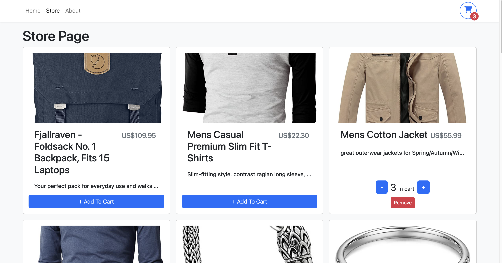
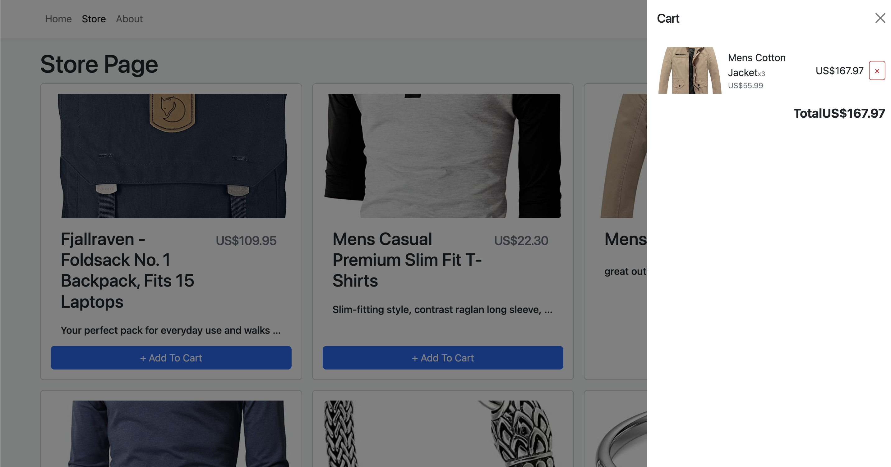

# React + TypeScript Shopping Cart Example

A sandbox project that illustrates the use of React + Typescript to create a mini ecommerce site.

Used to demonstrate file structure and use of types to integrate with React Hooks.

Data pulled from: https://fakestoreapi.com/

Keywords: React, Typescript, Bootstrap

Demo:
https://react-ts-shoppingcart-8n061av71-sandonl.vercel.app/
